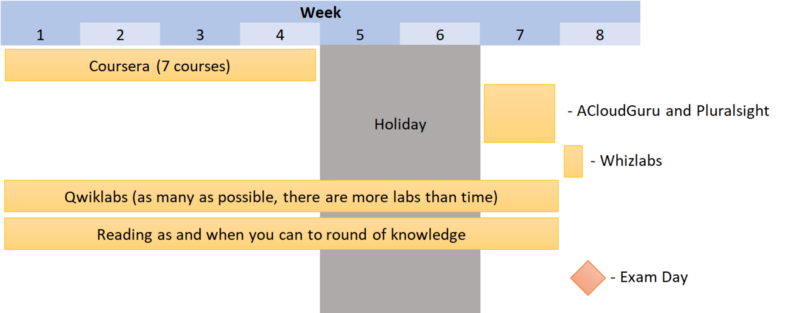
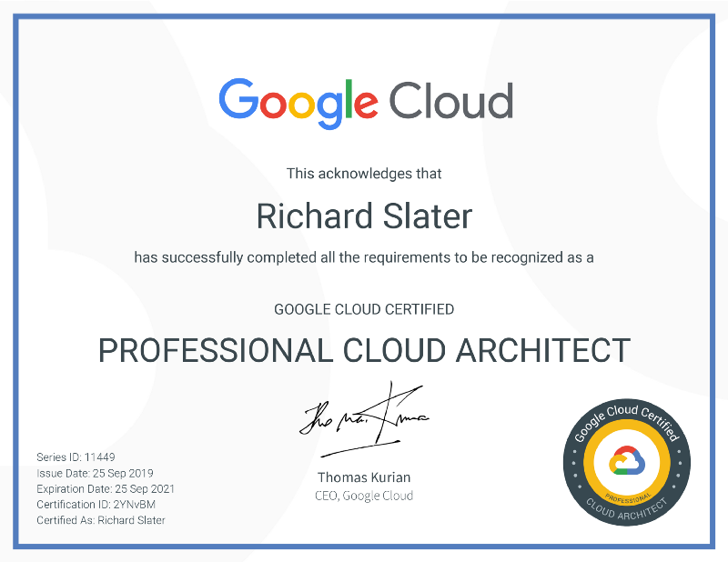

Photo by [Jonathan Daniels](https://unsplash.com/@dear_jondog?utm_source=medium&amp;utm_medium=referral) on [Unsplash](https://unsplash.com?utm_source=medium&amp;utm_medium=referral)

I took and passed my [Google Certified Professional Cloud Architect](https://cloud.google.com/certification/guides/professional-cloud-architect/) exam in September, this was an achievement for me, not because I have not held these types of certifications before, but because I have **next to no Google Cloud experience**. The majority of my career has been based within the Azure Cloud with a little bit of AWS here and there, so starting my move into Google by taking an exam was _not_ the path of least resistance.

I wanted to share some of the resources that I used to pass this exam so that everyone who follows me learns from my experiences and perhaps avoids some of the mistakes I made.

First off this exam is savage, the pass mark is somewhere around ~80% as opposed to other professional bodies and cloud platforms:

*   Azure Certifications: ~70%
*   AWS Certifications: ~60%
*   (ISC)²: ~70%

Don’t be tempted to rush the study and take the exam, give yourself enough time to study, practice and then take the exam when you are close to being ready.

I am a strong advocate for booking the exam in advance to give yourself a deadline. Aim for a deadline 12 weeks ahead, if like me, you lack in Google Cloud experience.### Prior Knowledge

**GCP Experience**: nothing, I played about and took a couple of the A Cloud Guru courses before the seven-weeks I gave myself to study. The exam does say it expects you to have one or more years’ experience with GCP — not having this myself made the study much harder because there is just so much to remember.

**Kubernetes Experience**: given that Kubernetes is a core part of Google’s offering and a product they created Kubernetes knowledge is essential. Starting with minimal Kubernetes knowledge gave me, even more, to memorise, especially kubectl commands to achieve specific objectives.

**DevOps**: 7+ years of DevOps experience certainly helped, there were 5–10% of questions that DevOps knowledge ruled out all but one or two of the possible answers making it more manageable.

**Other Cloud**: I have 7+ years of Azure, plus a little bit of AWS. This experience was an immense help to me, as all of the high-level patterns that apply to Azure can be used with Google if you squint a little bit.

**Architecture**: I have 2+ years of hands-on Azure Architecture, 1+ year working as a solutions architect for a major retail bank, with a further 5+ years of exposure to said architecture decisions so a reasonable grounding in architecture. I would say this experience helped me to rule out at least one response to 20% of the questions.### Study

I booked my exam for seven weeks in advance to focus my mind and dedicated myself to study. I **massively** underestimated the amount of effort as I was consistently working from 0800–2100 with some breaks for lunch and dinner, plus reading in bed or before I got up and weekend study. After four weeks of it, I was feeling burnt out. Fortunately, I had two weeks holiday in which I didn’t study for anything. Came back from holiday and went right back to 12 hour days for a week.

In total I booked 112 hours during work hours, with the remainder taken up by other responsibilities during the five-weeks, that didn’t account for the hours outside of work in the morning I was doing the reading, completing Qwiklabs. I was forced to watch all of the courses at 1.5x — 2x speed; otherwise, I wouldn’t have covered the material. I do recommend watching videos faster if you can as it makes better use of your time, but as the speed increases the retention is reduced so it can work against you.

**In short, I spent the equivalent of 3 full days a week studying, and then practice in the evenings and at the weekend for 2–4 hours — I’m fortunate that my employer wanted me to take this exam as soon as possible so gave me the time to do this.**

### Study Materials

I followed the following plan, during the holiday, I did a few Qwiklabs quests and read some resources here and there, more to keep my head in the game than to acquire significant knowledge.

Seven-week study plan for the Google Certified Professional Cloud Architect

**Coursera**

*   [Architecting with Google Compute Engine](https://www.coursera.org/specializations/gcp-architecture#courses)
*   [Preparing for the Google Cloud Professional Cloud Architect Exam](https://www.coursera.org/learn/preparing-cloud-professional-cloud-architect-exam)

**ACloudGuru**

*   [Kubernetes Deep Dive](https://learn.acloud.guru/course/kubernetes-deep-dive/dashboard)
*   [GCP: Associate Cloud Engineer](https://acloud.guru/learn/gcp-certified-associate-cloud-engineer)
*   [GCP: Professional Cloud Architect](https://acloud.guru/learn/gcp-certified-professional-cloud-architect)

**PluralSight**

*   [Getting Started with Kubernetes](https://www.pluralsight.com/courses/getting-started-kubernetes)
*   [Docker and Kubernetes the Big Picture](https://www.pluralsight.com/courses/docker-kubernetes-big-picture)

**Books**

*   Read [Kubernetes up and Running](https://amzn.to/2l7XjBc) by Brendan Burns, Joe Beda, and Kelsey Hightower
*   Read [The Kubernetes Book](https://amzn.to/2l2KLuH) by Nigel Poulton and Pushkar Joglekar
*   Read [Site Reliability Engineering](https://amzn.to/2lFzX6a) by Betsy Beyer, Chris Jones, Jennifer Petoff and Niall Richard Murphy
*   Read [Site Reliability Workbook](https://amzn.to/2pX8wqK) by Betsy Beyer, Niall Richard Murphy, David K. Rensin, Kent Kawahara and Stephen Thorne

_Note: the above Amazon.co.uk links are tied to my Amazon Affiliate account if you don’t want to use them I’ve included the authors to make searching for the books easier._

**Exam Guide and Case Studies**

Read the official [exam guide](https://cloud.google.com/certification/guides/professional-cloud-architect/), while the ACloudGuru courses and Coursera do go through the guide and the case studies, you should be familiar with both before you take the exam.

Spend at least an hour in each case study, as this is three hours that you won’t need to spend in the exam (the exam is only 2 hours long!).

**Google Cloud Minute**

Watch every single video on the [Google Cloud Minute Playlist](https://www.youtube.com/playlist?list=PLIivdWyY5sqIij_cgINUHZDMnGjVx3rxi) if you have no experience of Google; these are invaluable, and it only takes a few hours to watch every single one.

**Qwiklabs**

Do as many of the quests as you can manage, repetition helps you remember the fine details such as the command lines required to do something. 10% of my questions required remembering the commands used to do something. You can get free credits by following Qwiklabs on [LinkedIn](https://www.linkedin.com/company/qwiklabs-inc-/) and [Twitter](https://twitter.com/qwiklabs), also [here on Medium](https://medium.com/@sathishvj/qwiklabs-free-codes-gcp-and-aws-e40f3855ffdb).

*   [GCP Essentials](https://www.qwiklabs.com/quests/23)
*   [Baseline: Infrastructure](https://www.qwiklabs.com/quests/33)
*   [Baseline: Deploy &amp; Develop](https://www.qwiklabs.com/quests/37)
*   [Deploying Applications](https://www.qwiklabs.com/quests/26)
*   [Baseline: Data, ML, AI](https://www.qwiklabs.com/quests/34)
*   [Google Developer Essentials](https://www.qwiklabs.com/quests/86)
*   [Data Engineering](https://www.qwiklabs.com/quests/25)
*   [Cloud Engineering](https://www.qwiklabs.com/quests/66)
*   [Networking in the Google Cloud](https://www.qwiklabs.com/quests/31)
*   [Stackdriver Logging](https://www.qwiklabs.com/quests/81)
*   … plus **all __** of the Qwiklabs recommended by ACloudGuru and Coursera!

[**Whizlabs**](https://www.whizlabs.com/google-cloud-certified-professional-cloud-architect/practice-tests/)

Take a couple of the practice tests more seven days before your exam then if you find that you are scoring well below 80% you can postpone the exam day to give yourself more time to prepare. I didn’t do this, I scored 80% on the [Google Practice Exam](https://cloud.google.com/certification/practice-exam/cloud-architect) and 65% and 70% on two of the Whizlabs exams, I passed the exam in the end though.### Taking the Exam

The Kryteron platform isn’t great, but it does work well enough. Make sure you read and understand the rules before you take your exam as this could save potential embarrassment on the day.

The exam is predominantly made up of **multiple-choice-single-response questions**, i.e. select one of four options; about 20% of the items were **multiple-choice-multiple-response questions**, which means you have to choose two or more of the answers.

My strategy for multiple-choice-single-response questions is to go through each option and rule out anything wrong, then rank the remaining options from least wrong to most wrong. This strategy works well on (ISC)² exams as it’s rarely a case of there being one correct answer.

For the multi-choice-multiple-response answers, you have to make a judgement decision about the correct answers, pay careful attention to the questions it will usually, if not always, include the exact number of answers to select. Focus on ruling out anything wrong and then make a judgement call about whatever is left.### Pass Your Exam

Once you finish your exam, you won’t find out if you have passed or failed immediately, I found that the Kryteron site listed my exam as provisionally passed a few hours after the exam. I then got an e-mail from Google Cloud congratulating me a few days later, along with a [link to my certificate](https://www.credential.net/bcf7500e-83a9-4b73-bb3d-c7359e15c71f).

If you happen to fail, you can re-take your exam although there are mandatory wait periods between exams:
> If you don’t pass an exam, you can take it again after 14 days. If you don’t pass a second time, you must wait 60 days before you can take it a third time. If you don’t pass the third time, you must wait a year before taking it again. You may attempt the exam in multiple languages, but each attempt regardless of language counts toward the total permissible attempts and the waiting period between attempts still applies. Payment is required each time you take an exam. Circumventing this retake policy by registering under a different name or any other means is a violation of the exam terms and conditions and will result in a denied or revoked certification. — [Certification FAQs](https://cloud.google.com/certification/faqs/)
