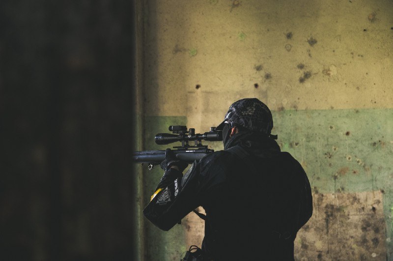

Photo by [Daniel Stub](https://unsplash.com/@dstub?utm_source=medium&amp;utm_medium=referral) on [Unsplash](https://unsplash.com?utm_source=medium&amp;utm_medium=referral)

### Mouse

I bought a [Razer Basilisk V2](https://www.razer.com/gaming-mice/Razer-Basilisk-V2/RZ01-03160100-R3U1) when it was on Cyber Weekend deals on Amazon; paid £32 for it, which is pretty good for fairly decent mouse, I see plenty of people using [Zowie Mice](https://zowie.benq.eu/) which either means they are sponsored by BenQ/Zowie or they are really the best mice for CS:GO — I’ll leave it to you to decide.

Settings wise, I use the following:

1.  1,200 DPI with a sensitivity of 0.8 giving me an effective DPI, or eDPI, of 960,
2.  Zoom Sensitivity of 1.0,
3.  Raw Input turned on,
4.  Mouse acceleration off,

#### Bindings

I then bind the following buttons:

1.  Mouse 1 (Left Click): Fire
2.  Mouse 2 (Right Click): Secondary Fire, Scope, etc.
3.  Mouse 3 (Middle Click): Chat Wheel 2
4.  Mouse 4: Mic Push-to-Talk
5.  Mouse 5: Ping
6.  Mouse Wheel Up: Chat Wheel 1
7.  Mouse Wheel Down: Chat Wheel 3

### Keyboard

I still use a Logitech G15 that was bought for me when I was doing some Open Source development on EVEMon; it’s a great keyboard IMHO and has been rock solid, it’s not sold any more though.

#### Movement Bindings

I use standard bindings for movement, so WASD, Shift, Space, Ctrl.

#### Weapon Bindings

I use mostly standard bindings for weapons, i.e. Use (E), Reload (R), Quick Switch (QQ), Drop Weapon (G), Buy Menu (B), Weapons 1–3, I do however unbind Cycle Grenades and use “4&#34; for the Zeus — for what it’s worth.

I then bind grenades to:

1.  HE Grenade: Z
2.  Flashbang: X
3.  Smoke: C
4.  Molly: V
5.  Healthshot: \

Autobuy is F3, and Rebuy is F4.

### Settings

1.  Show Team Positions in HUD is set to ‘Show Location and Equipment’
2.  Switch Weapon on Pickup is set to No
3.  Open Buy Menu with Use Key is set to No

### Cursor
> CSGO-GFRAm-MhL5Q-G3fMW-majjo-j7kXM
