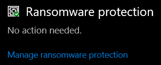
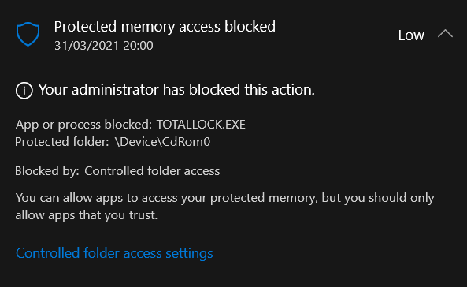

I had an unusual experience when using an Integral Crypto FIPS 197 device on a new laptop. This particular device uses `TotalLock.exe` on a read-only CDFS partition to enter the decryption key (password) to mount a hidden partition.

When I went to access the device, i.e. run `TotalLock.exe` from the D: drive, the message:
> Failed to initialize secure device

After investing the system event logs with minimal information, and checking the executable wasn’t blocked from explorer, I considered how Windows Defender might be affecting the device.

As it turns out there is Ransomware protection built into Windows Defender, which you could access by **pressing Start** the typing “**Virus**” to open “Virus and Threat Protection”:

Virus and Threat Protection from the Start Menu

From there scroll down and select **Ransomware protection**:

Scroll down to find Ransomware Protection

Click on Block history, then select the most recent blocked action:

You will be asked to allow the app to make changes to the device, via User Account Control. However once approved you will likely see that `TOTALLOCK.EXE` was blocked:

From there you are able to allow access to the “protected folder” by that executable.

Alternatively you can select “Allow an app through controlled folder access” in the preceding screen which then select `TotalLock.exe` from the `D:` drive approve access.
