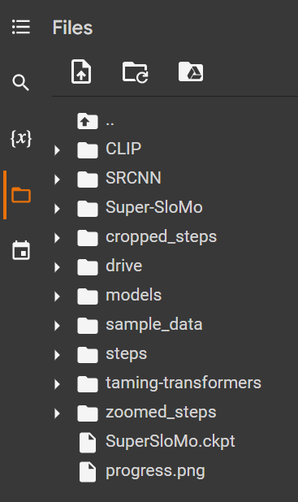
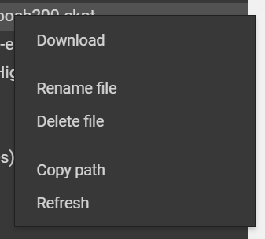

#### On Machine Learning

#### Or how do I fix an unpickling error with a PyTorch checkpoint!

Photo of a blue-green hummingbird drinking from an Orange Flower by [James Wainscoat](https://unsplash.com/@tumbao1949?utm_source=unsplash&amp;utm_medium=referral&amp;utm_content=creditCopyText) on [Unsplash](https://unsplash.com/s/photos/hummingbird?utm_source=unsplash&amp;utm_medium=referral&amp;utm_content=creditCopyText)

If you are here because your Google Colab notebook that uses the [Super-SloMo](https://github.com/avinashpaliwal/Super-SloMo) model is failing. Specifically, with a `RuntimeError` or you see the following in the output:
``_pickle.UnpicklingError: invalid load key, &#39;&lt;&#39;.` `

Then this is because the code that is used in the vast majority of notebooks to fetch this file has stopped working. We [discovered](https://github.com/avinashpaliwal/Super-SloMo/issues/106) that instead of downloading a 150Mb PyTorch checkpoint, it downloads a small HTML error page.

The quick fix is to:

1.  Download a [copy of the checkpoint](https://drive.google.com/open?id=1IvobLDbRiBgZr3ryCRrWL8xDbMZ-KnpF),
2.  Save it to your Google Drive,
3.  Connect to your Google Drive in Colab,
4.  Update the `pretrained_model` variable with the path to the checkpoint.

### Connect to Google Drive

With the “Files” tab open, click the third icon at the top “Mount Drive”:

You can also use the following code in your notebook:

### Update your notebook

Most notebooks will have something similar to the following code in a cell:

You can simply **replace** everything above with one line:

Chances are you’re Google Drive is not organised in the same way as mine, but you can easily find the file in the left hand “Files” panel then right click and select “Copy path”:

### What if I can’t download the file?

It’s possible that the original author may remove the file, or that the usage limits for his account will be hit, in which case the following checkpoints can be used:

Provided by [MSFTserver on GitHub](https://github.com/MSFTserver):

[SuperSloMo-Python37+1.10.0+cu111-epoch150.ckpt](https://www.dropbox.com/s/f2f5pi76z6aaehe/SuperSloMo-Python37%2B1.10.0%2Bcu111-epoch150.ckpt)

Provided by myself:

[SuperSloMo-Python37+1.10.0+cu111-epoch150.ckpt](https://drive.google.com/file/d/1uok9sHVx8FwttH5N3m-CmcauIfR1XBvd/view)

[SuperSloMo-Python36+0.4.1+cu92-epoch200.ckpt](https://drive.google.com/file/d/10rT8tUmIeJMTnJnmLnBc6W1G1ZFciBQG/view)

Try not to use these in scripts though as Dropbox and Google Drive do limit how many times a day one file can be downloaded.
