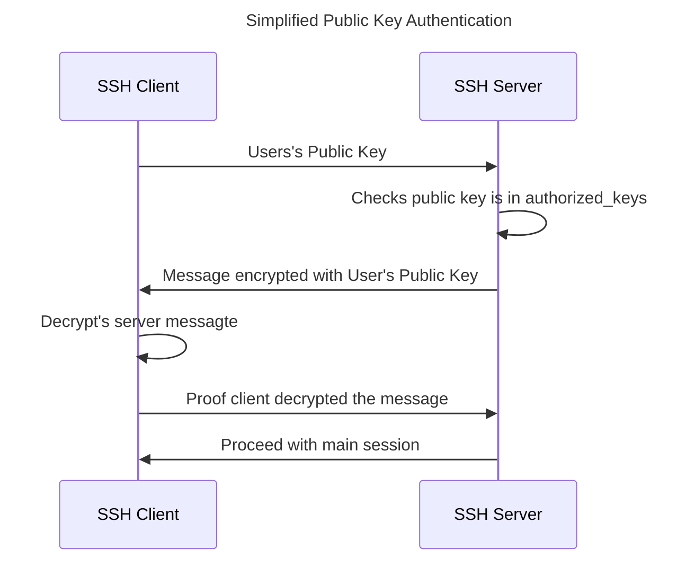

## Introduction

Fundamentally I'm a Windows-based software engineer, my preferred language is C# although my preferred IDE is JetBrains Rider, which is cross-platform. That being said, I do a lot of DevSecOps type work, that often means needing POSIX compliant operating systems like Ubuntu for NPM/Node, Ansible, etc.

We are not quite yet in a world where it's simply a case of using any of the three major operating systems (Windows, macOS, Linux) and everything else "just works", fortunately Windows Subsystem for Linux exists, bringing a lightweight and easy to manage VM to basically any Windows install.

Having a separate, albeit lightweight, VM for Linux has its downsides. Traditionally I have effectively maintained these two machines as separate operating systems, for example, using a separate SSH and GPG key on the WSL host. This is complicated by there being no easy way to share a YubiKey (or any other smart-card type GPG key module) between Windows and WSL.

### Explanation of Acronyms and Terms

There are a number of terms used in this post, in an attempt to help "level up" everyone to the same level rather than throw commands in your face here are some explanations:

- **GPG - GNU Privacy Guard** is a replacement for Phil Zimmermann's PGP tool, PGP is now owned by Symantec, and is non-free. GPG provides specification and software for public key infrastructure (PKI) with certificate purposes including Signing, Encryption and Authentication.
- **SSH - Secure Shell** is a protocol for securely sending commands to a remote machine over a potentially unsecured network, i.e. the Internet etc. The most popular client-server implementation of the SSH protocol is OpenSSH which is available for basically any operating system including [Windows](https://learn.microsoft.com/en-us/windows-server/administration/openssh/openssh_install_firstuse).
- **YubiKey** is a type of "security module" that plugs into a USB port and allows you to store private keys securely on the module, this also acts as a form of multifactor authentication (MFA/2FA) as you have to both know the PIN for the YubiKey and to have it with you to be able to use your private keys.
- **WSL - Windows Subsystem for Linux** is a lightweight virtual machine running a Linux distribution integrated into the Windows Machine, i.e. you can access the Linux filesystem from Linux and vice versa.

### Rationale

Let's start by saying there is nothing wrong with SSH 2 keys, the serve the purpose they were designed for. Specifically they enable a trusted connection to be established between two machines across an untrusted network. In fact using a YubiKey and GPG to manage the keys is more or less transparent to the server.

It's worth understanding that the private key never leaves your computer when establishing a connection to the remote server, when using the PGP application on your YubiKey they key never leaves, and in fact can't leave, the YubiKey. What is shared is the public key which will look something like this:

```openssh
ssh-rsa AAAAB3NzaC1yc2EAAAADAQABAAACAQCymxqsXwWvUx9ISVjws96azY3qWXmfmNd2fO5UQSQbS5hAXK2Wkey6re3t3j3d0sKshrt975MmmiEKSMFZd8CXt7YYNgq0zjLsSjSbZHSXyE/SRrsk928oJNCeQ28wBlU5T1nM7/+dXVy+54k/DobJPlwvXloifHO6iXFvUzK0YsEDKPb8vB4wnOG6jqzdvM4nT4vgqmuYEGiFHidnX1/fqXFIJhNYZDYPfcYN4LcE1Z39y+X5ey/bvUjGjIhJaAq+tYGvusbsYsR/0K+ado7coZ6IbY9ilO0DLqclb97brSJNSIRux24QNfmYfJX+1NUNBEw/UTxTzm8KOH827TRGvzo5JSz6UNS9kGQvjfXm8IXkeKDtgA+IwUKS7SHenPVcmcPSPgxBaeUZ2pAl+vK9Jq1Rinco8kV6bJXWIppaVXuil7r15+cQjPosxx9fYo7lP0WlhqS/vi+wwBY9QY1dbiO6CaxnfZqpUgbTXeXemHcwTz8Mjba0stoNmpGQC3Q8qkOwrJeBQlPwe49WRjw4zHMHIXUZ29pgVoOd87MSoHcui6z+dXXjGBVYwBWT1x0IrRAvYdGt9l5JB7Z0XfGk15ezdL1VqLgA95x0Dutp7VqavLiDCUqAcj8E5ZYj81/Z9/judJtLfX8eHoxcQsPg+gdlUTqENE0dz/RjK3rYRw== Richard Slater
```

The first part `ssh-rsa` describes the purpose and algorithm for the key, if it was a DSA key it would be `ssh-dss` and if it was an elliptic curve key `ssh-ed25519`. The second part is the actual public key itself, it's `base64` encoded binary data, and is essentially one big number. After the key there is a comment `richard@ws0001`. What you will see is that PGP based keys are basically identical to this:

```openssh
ssh-rsa AAAAB3NzaC1yc2EAAAADAQABAAACAQDB7n7NyXkm6OucNqS9ExJPUJk/+jhcIxTJD3RnEt2IywDvHWUOBBEcfpOxprj54UsJDrfAslIvhFZkjEi+3Tgow1qC7+HVS3GfNu1YCP+MmTOnnEXgAhtaM7LTVFgt9QYEZeSpgrIIaKSlb515ln4Ghy+Jehbs06V6TcJYG/qIQd1RXN40O13VEyXmNAVRSf9ra7Emfg1OLzu7wabhxLqeLGBJ2cf0QKf0+ip+jYqbq/D2ZsCBYmGgQcKiopuCW7a51zzu/Df6G+SJS2yzWwZx1PjJ0yqUFWpuVDlRJi2sBbBTL1TUftMzRiZsyQPrS/eAlGLxzGjmvjzZ3pLZtD5xc6Qs7By/r/5Acxbp+2wn3fuo6lVmD5P54R0PsQyw7jrV7C7Zb7Cl7EuXZqW3Pm42aowq4skstTmdXsZZx0RkFvFaxDw5IFtC78E5Dwy/4pECLNXQ8stc6A5MKElGwHhcABK8IdUGf6R0lU4yEzknb7KhvERZRKEslQh3Jcn+7zScc5WBbjT3SMEdySWPMwreOpe1gnt+6MSf/8lpQCyBOP1Mr4/SSa95pJpWyRr1OSPi0KgOvSTVwppG6thcV1fRpGsDtpPB192KKrzInP3fxF0UOT3PhLgn7zZAlyGBAIel4m/zK0tqjL3kG2CNwnOkMrq5CTdK1JS7KnK4a/rxCw== cardno:11_021_065
```

From the perspective of the server there is zero-difference between the two types of key as the comment is ignored, the server has prior knowledge of your public key, and sends a challenge encrypted using your public key expecting proof in return that you can decrypt the encrypted message:



In this flow it doesn't matter if the Private Key is in OpenSSH, PGP, Putty or practically any format, simply the algorithm has to match.

So why then, for me, it's simply a case of adding a second factor. What I mean by this is even with my SSH Private Keys stored safely on Encrypted Partitions (BitLocker or LUKS) and protected with a strong password that is stored in a Password Manager, there is still a chance that that key could be exfiltrated from my storage and the password could be captured using a keylogger.

The more you use a computer, the higher the risk that something like that could happen. I always try to work on the principle that there are two types of people in the world, those who have experienced a data breach and those who will experience a data breach.

On that basis, using a YubiKey gives me two new controls over the private key:

1. It can't be exfiltrated from the YubiKey, that's because the YubiKey actually does the signing of the message not your computer and the keys are non-exportable. Thus, the device must be physically present, it's the "What You Have (in your possession)" in multifactor Authentication terms.
2. The first time I connect the YubiKey, I must enter a PIN, and every time I authenticate a message I must touch the YubiKey. This is the "What you know" in Multi-factor authentication terms.

It's not a huge change, but it's an additional control over the security of my remote accounts. Additionally, I use GPG and my YubiKey to sign my commits, authenticate to services using WebAuthn and as my preferred TOTP/one time code provider, so I will have my YubiKey with me most of the time.

#### Alternative Options

- [USBIPD (Universal Serial Bus Internet Protocol Daemon)](https://learn.microsoft.com/en-us/windows/wsl/connect-usb) works by forwarding USB packets over the local interface, however it requires exclusive access of the YubiKey by WSL.
- [npiperelay](https://github.com/jstarks/npiperelay) to connect the `SSH_AUTH_SOCK` pipe on Linux to the Named Pipe on Windows, I really enjoy this idea however it's a little hard to get right requiring some messing about with SystemD or your profile to ensure that there is only one version running and that it has the relevant permissions to access the pipe.
- [GPG Agent Forwarding](https://github.com/drduh/YubiKey-Guide?tab=readme-ov-file#gnupg-agent-forwarding) can be used, however this requires using SSH to access the WSL machine, Agent Forwarding may be useful if ultimately you are accessing other machines and need your GPG and SSH keys accessible from that host (i.e. connecting to a bastion host).
- [wsl-ssh-pageant](https://github.com/benpye/wsl-ssh-pageant) works in a very similar way to npiperelay, however it is an unnecessary step with modern versions of OpenSSH for Windows.
- [Native FIDO2/WebAuthn support in OpenSSH](https://github.com/PowerShell/openssh-portable/pull/541) this is an option, I didn't try this because I already have a GPG key that I use on a day-to-day basis, YubiKey support via FIDO2 was introduced into [OpenSSH in 8.2](https://blog.snapdragon.cc/2020/02/23/direct-fido2-u2f-support-in-openssh-8-2-on-macos/).
- I have in the past used separate keys for WSL, i.e. a different SSH and GPG key that is only used from within WSL.
## One-time Setup

There is a separate process between Windows and WSL, you can skip the WSL if you only need GPG SSH Authentication from Windows.
### Prerequisites

I used the following software and versions:

- Windows 11 (Version 23H2):
	- GnuPG 2.4+,
	- Microsoft's OpenSSH 8.6+,
	- Some kind of editor that write files ending in LF format, CRLF will not work, I used Visual Studio Code,
- Ubuntu WSL, other distros will likely work as well, although Ubuntu tends to be the best supported distro for WSL.

You must have the relevant GPG keys, I strongly recommend creating a master certify key and then a subkey for each of designated purposes: encryption, signing and authentication. You can use [DrDuh's YubiKey Guide](https://github.com/drduh/YubiKey-Guide) 
### Windows Setup

1. Stop and Disable the "OpenSSH Authentication Agent" using `services.msc` or with PowerShell:

	```powershell
	Stop-Service -Name ssh-agent
	Set-Service -Name ssh-agent -StartupType Disabled
	```

1. Install GPG using the excellent WinGet package manager, Gpg4win will also work, although it comes with some extra software which I don't use:

    ```PowerShell
    winget install GnuPG.GnuPG
    ```

1. Find `gpg-agent.conf` in your GnuPG configuration folder, it should be in `%APPDATA%/gnupg` / `$env:APPDATA/gnupg` and add the following lines of config, be 100% sure that this is saved using LF endings not CRLF

	```conf title:"%APPDATA%/gnupg/gpg-agent.conf"
	enable-ssh-support
	enable-putty-support
	enable-win32-openssh-support
	
	```
	
1. Find `gpg.conf` in your GnuPG configuration folder, and add the following lines of config, again ensure that it's LF not CRLF line endings:

	```conf title:"%APPDATA%/gnupg/gpg.conf"
	use-agent
	
    ```
    
1. Find the GPG Keygrip of your Authentication Key:

	```bash
	# gpg --list-secret-keys --with-keygrip
      sec#  rsa4096 2021-04-04 [C] [expires: 2031-04-02]
            12D116AE57EC434DA115DB503A18D6E0EC26FA92
            Keygrip = 8EC87770C2AB7E08F0B74076F21E5E0E4AD2B1D9
      uid           [ultimate] Richard Slater (Personal) <r@example.com>
      uid           [ultimate] Richard Slater (Corp) <rs@example.com>
      ssb>  rsa4096 2024-03-10 [S] [expires: 2025-03-10]
            Keygrip = BDD95EA7DB56BDA213E9CE84F85060D1578B21CF
      ssb>  rsa4096 2024-07-26 [A] [expires: 2025-07-26]
            Keygrip = 0A50C016AA993AF5F0A508BF07361DEBB309D52F
	```

1. Now update `sshcontrol` in your GnuPG configuration folder to add your key, again ensure that line endings are LF not CRLF.

	```conf title:"%APPDATA%/gnupg/sshcontrol"
	0A50C016AA993AF5F0A508BF07361DEBB309D52F
	
	```

1. Add an environment variable to provide the named pipe to SSH, you can do this through System Properties → Environment Variables or through PowerShell:

	```powershell
	[Environment]::SetEnvironmentVariable("SSH_AUTH_SOCK", "\\.\pipe\openssh-ssh-agent", [System.EnvironmentVariableTarget]::User)
	```

1. Update your PowerShell profile and add the following line to start the GPG Agent when you launch a terminal: 
	
	```bash
	gpg-connect-agent /bye
	```

1. Open a new terminal to ensure that the environment variable is updated, then issue the following command, expect a pin entry dialogue and after a few seconds you should get a connection to GitHub.

	```bash
	# ssh git@github.com

	Hi RichardSlater! You\'ve successfully authenticated, but GitHub does not provide shell access.
	Connection to github.com closed.
	```

1. If this doesn't work check the output of `ssh-add -L` it should show a `ssh-rsa` key:
	
	```bash
	# ssh-add -L
	ssh-rsa AAAAB3NzaC1yc2EAAAADAQABAAACAQDB7n7NyXkm6OucNqS9ExJPUJk/+jhcIxTJD3RnEt2IywDvHWUOBBEcfpOxprj54UsJDrfAslIvhFZkjEi+3Tgow1qC7+HVS3GfNu1YCP+MmTOnnEXgAhtaM7LTVFgt9QYEZeSpgrIIaKSlb515ln4Ghy+Jehbs06V6TcJYG/qIQd1RXN40O13VEyXmNAVRSf9ra7Emfg1OLzu7wabhxLqeLGBJ2cf0QKf0+ip+jYqbq/D2ZsCBYmGgQcKiopuCW7a51zzu/Df6G+SJS2yzWwZx1PjJ0yqUFWpuVDlRJi2sBbBTL1TUftMzRiZsyQPrS/eAlGLxzGjmvjzZ3pLZtD5xc6Qs7By/r/5Acxbp+2wn3fuo6lVmD5P54R0PsQyw7jrV7C7Zb7Cl7EuXZqW3Pm42aowq4skstTmdXsZZx0RkFvFaxDw5IFtC78E5Dwy/4pECLNXQ8stc6A5MKElGwHhcABK8IdUGf6R0lU4yEzknb7KhvERZRKEslQh3Jcn+7zScc5WBbjT3SMEdySWPMwreOpe1gnt+6MSf/8lpQCyBOP1Mr4/SSa95pJpWyRr1OSPi0KgOvSTVwppG6thcV1fRpGsDtpPB192KKrzInP3fxF0UOT3PhLgn7zZAlyGBAIel4m/zK0tqjL3kG2CNwnOkMrq5CTdK1JS7KnK4a/rxCw== cardno:11_073_070
	```

1. If all you need is support from within Windows then you are done, if you want to configure WSL then you will need a final step on Windows before switching over to WSL.
1. Install `npiperelay.exe` using go install.

	```shell
	go install github.com/jstarks/npiperelay@latest
	```
	
1. All being well this should install `npiperelay.exe` in `$env:USERPROFILE/go/bin` you will need to reference this from WSL, so check the path.
### WSL Setup

1. Alias `gpg` on WSL to `C:\Program Files (x86)\GnuPG\bin\gpg.exe` on Windows:

	```shell
	sudo ln -s /mnt/c/Program\ Files\ \(x86\)/GnuPG/bin/gpg.exe /usr/local/bin/gpg
	```

1. Alias `ssh` and `ssh-add` on WSL to their Windows counterparts on Windows:

	```shell
	sudo ln -s /mnt/c/Windows/System32/OpenSSH/ssh.exe /usr/local/bin/ssh
	sudo ln -s /mnt/c/Windows/System32/OpenSSH/ssh-add.exe /usr/local/bin/ssh-add
	```

1. This works because you can call any Windows Executable from WSL, and the `gpg` executables are compatible at the `stdin` and `stdout` level. The original executables are left in place, as `/usr/loca/bin` is typically in your path **before** `/usr/bin`.
1. Now configure [git to sign your commits](https://docs.github.com/en/authentication/managing-commit-signature-verification/telling-git-about-your-signing-key) specifically you will need to run the following commands:

	```
	git config --global user.signingkey [YOUR KEY ID]
	git config --global commit.gpgsign true
	```

1. At this point you can test everything works:
	1. Create a new directory and change:
		```
		mkdir gpg-test
		cd gpg-test
	    ```
    
	1. Initialize a new git repository with:
		```
		git init
	    ```
    
	1. Create a file to commit:
		```
		touch text.txt
		echo "test" >> test.txt
	    ```

	1. Add the file to git:
		```
		git add test.txt
		```

	1. Commit your changes with`git commit`, this should prompt you for a commit message by opening up your `$EDITOR` and once that is saved and exited then prompt you for your YubiKey PIN and touch.
	1. Push the changes to the remote `git push origin HEAD` this should require you to touch your YubiKey (if touch is configured) to authenticate with GitHub.

I've tested the testing flow in Visual Studio too, and that works flawlessly when launched from WSL with 
```shell
code .
```

If any of this doesn't work, then check out the troubleshooting next.
## Troubleshooting

### It works in Windows / PowerShell but doesn't work in WSL
First, restart your shell, it's possible that something is cached given you have just messed about with executables in your path.

This could be for a couple of reasons, potentially the `PATH` is misconfigured, run the following two commands:

```shell
echo $PATH | grep /usr/bin
echo $PATH | grep /usr/local/bin
```

`/usr/local/bin` should appear **before** `/usr/bin` in your path, you can check where the relevant executables are with:

```shell
which ssh
which ssh-add
which gpg
```

If any of these are not coming from `/usr/local/bin` then you need to adjust your `PATH` appropriately. 

### GPG Agent Crashes

This is normally because one of the GPG configuration files is saved with CRLF line endings, go through each of the files and make sure they have LF line endings.

### General Troubleshooting

If something isn't working I find it helpful to follow a basic troubleshooting workflow:

1. Are you able to see the keys with `gpg --card-status`? If not then check the card is connected correctly, sometimes you will need to unplug it and plug it in again.
2. If you are using the Microsoft Terminal Services client or certain virtualization platforms (Hyper-V, VirtualBox, VMWare) it's possible they have installed USB Filters to enable USB devices to be "passed through" to virtual machines. Check the configuration to make sure running machines are not grabbing the YubiKey exclusively.
3. Are the public keys available in your local key ring? You can [import them](https://github.com/drduh/YubiKey-Guide?tab=readme-ov-file#using-yubikey) if they are not. Sometimes it's necessary to relearn the card (`gpg-connect-agent "scd serialno" "learn --force" /bye¬`) if you have multiple YubiKeys.
4. Are you able to authenticate with your key to GitHub with `ssh git@github.com`? If not check `ssh-add -L` the public key listed should also be listed under both SSH keys and GPG keys in your [GitHub Settings](https://github.com/settings/keys).
5. When you commit a change to a Git repository, is it signed? You can check with `git log --show-signature` and looking for "Good signature" next to each commit. If they are not signed check Git is configured, `~/.gitconfig` should contain `gpgsign = true` and `signingkey = ` with your key ID.
6. If you are able to complete the above operations from Windows then you "**should**" be able to complete them from WSL too, if not check that `/usr/local/bin` appears first in your `PATH` and change as required.
7. If none of these help, check out the [Troubleshooting Guide](https://github.com/drduh/YubiKey-Guide?tab=readme-ov-file#troubleshooting) in DrDuh's YubiKey guide.
## References

Beyond the links embedded in the document above the following pages provided invaluable reference material working out a process:

1. Matus Novak (2020), _GPG + Git SSH Authentication and Signing on Windows 10_. [online] Gist. Available at: https://gist.github.com/matusnovak/302c7b003043849337f94518a71df777, [Accessed 8 Aug. 2024].
2. opensource.com. (2019). _How to enable SSH access using a GPG key for authentication | Opensource.com_. [online] Available at: https://opensource.com/article/19/4/gpg-subkeys-ssh, [Accessed 8 Aug. 2024].
3. PowerShell (2017). _Support GPG and smartcard users · Issue #827 · PowerShell/Win32-OpenSSH_. [online] GitHub. Available at: https://github.com/PowerShell/Win32-OpenSSH/issues/827 [Accessed 8 Aug. 2024].
4. Justyn (2019). _Using a Yubikey for GPG in WSL (Windows Subsystem for Linux) on Windows 10_. [online] I Am Justyn. Available at: https://justyn.io/blog/using-a-yubikey-for-gpg-in-wsl-windows-subsystem-for-linux-on-windows-10/ [Accessed 8 Aug. 2024].
6. Scott Hanselman (2018). _How to setup Signed Git Commits with a YubiKey NEO and GPG and Keybase on Windows_. [online] Available at: https://www.hanselman.com/blog/how-to-setup-signed-git-commits-with-a-yubikey-neo-and-gpg-and-keybase-on-windows [Accessed 8 Aug. 2024].
7. Matthias Rampke (2023). _GPG signing with full gpg-agent support in WSL2: the easy way_. [online] Gist. Available at: https://gist.github.com/matthiasr/473072eeffe449459e3ccd0f5192afc7 [Accessed 8 Aug. 2024].